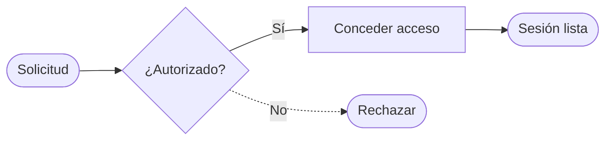

# Solicitudes de acceso

Este README combina documentación y un diagrama de decisiones.
Kairo convierte el bloque **Mermaid** en un diagrama editable.

## Flujo de aprobación

## Prueba el ejemplo

- Cambia «Conceder acceso» por «Abrir proyecto».
- Cambia la etiqueta «Sí» por «Aprobado».
- Pulsa «Aplicar al lienzo» para editar los nodos y conexiones.

El título y los párrafos documentan el proceso; el bloque Mermaid
contiene los nodos, las formas, las flechas y sus etiquetas.
